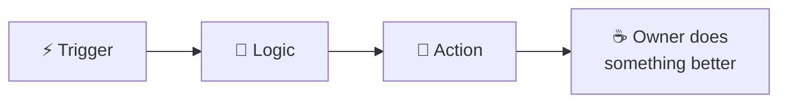

**Ameen** &nbsp;·&nbsp; India 🇮🇳 &nbsp;·&nbsp; Independent

Automation dev and technical lead for business owners. I build the systems, they get their time back.

---

---

## ⚡ `TRIGGER` — what starts it

Someone's drowning in a task a computer should have handled years ago. Copy-pasting orders. Re-typing leads into a CRM. Chasing a spreadsheet at 1am.

That's my cue.

## 🧠 `LOGIC` — how I think about it

- **Map it first.** Every messy process has a shape. Find it before writing a line.
- **Boring beats clever.** A workflow that runs unattended for a year > a beautiful one that breaks on Tuesday.
- **Own the whole path.** Scoping, building, handing it over, and being the person who fixes it at 2am.

## 🔧 `ACTION` — what I build with

---

## 📦 `OUTPUT` — things that shipped

<table>
<tr>
<td width="50%" valign="top">

### 🛒 [smart-product-uploader](https://github.com/ameenkhan8k/smart-product-uploader)
Writes its own SEO copy, then pushes finished products into WooCommerce.
 `Notion` `LLM` `WooCommerce`

</td>
<td width="50%" valign="top">

### 🔀 [airtable-webhook-ghl](https://github.com/ameenkhan8k/airtable-webhook-ghl)
Airtable rows → webhooks → Go High Level. No human in the middle.
 `Airtable` `Webhooks` `GHL`

</td>
</tr>
<tr>
<td width="50%" valign="top">

### 📝 [crm-automation-gpt-summary-n8n](https://github.com/ameenkhan8k/crm-automation-gpt-summary-n8n)
Reads the CRM noise, hands back a summary worth reading.
 `n8n` `LLM` `CRM`

</td>
<td width="50%" valign="top">

### 📈 [pytrends-flask-api](https://github.com/ameenkhan8k/pytrends-flask-api)
Google Trends, wrapped in an endpoint any workflow can call.
 `Python` `Flask` `PyTrends`

</td>
</tr>
<tr>
<td width="50%" valign="top">

### 🎬 [yt-transcript-api](https://github.com/ameenkhan8k/yt-transcript-api)
YouTube video in, clean transcript out.
 `Python` `API`

</td>
<td width="50%" valign="top">

### 🚧 next
Something's always half-built in a branch somewhere.
 `wip`

</td>
</tr>
</table>

---

## 📊 `RUN HISTORY`

---

## 🔗 `WEBHOOK` — reach me

 

⚙️ Every workflow here started as someone saying *"there has to be a better way."*

